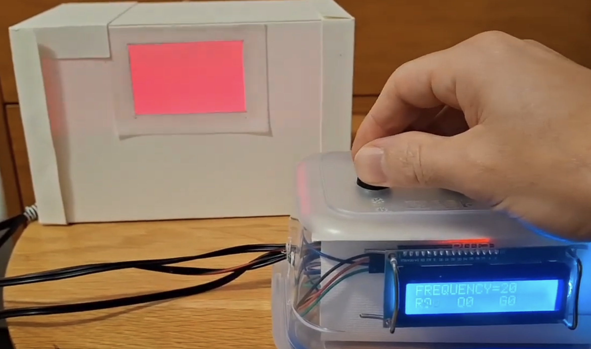
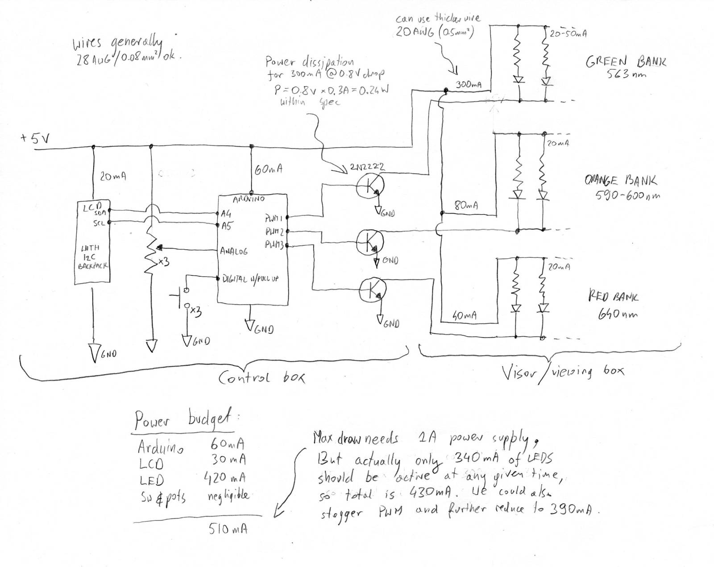
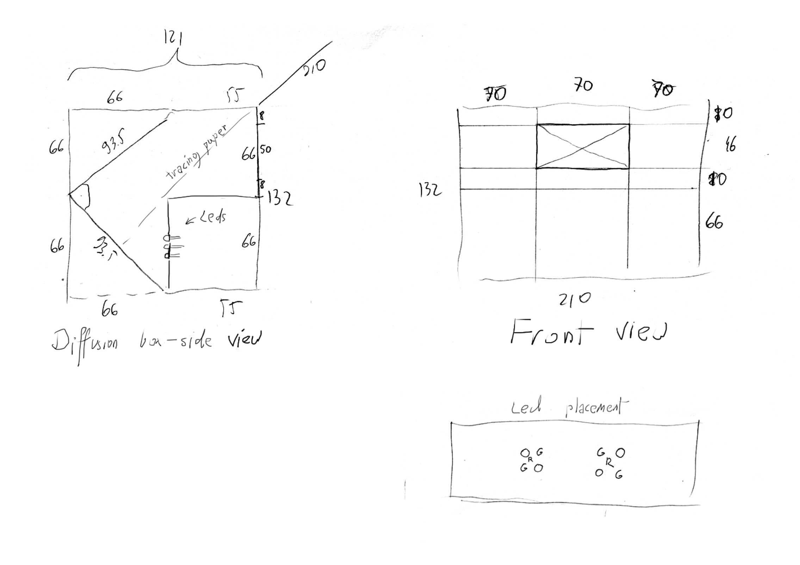
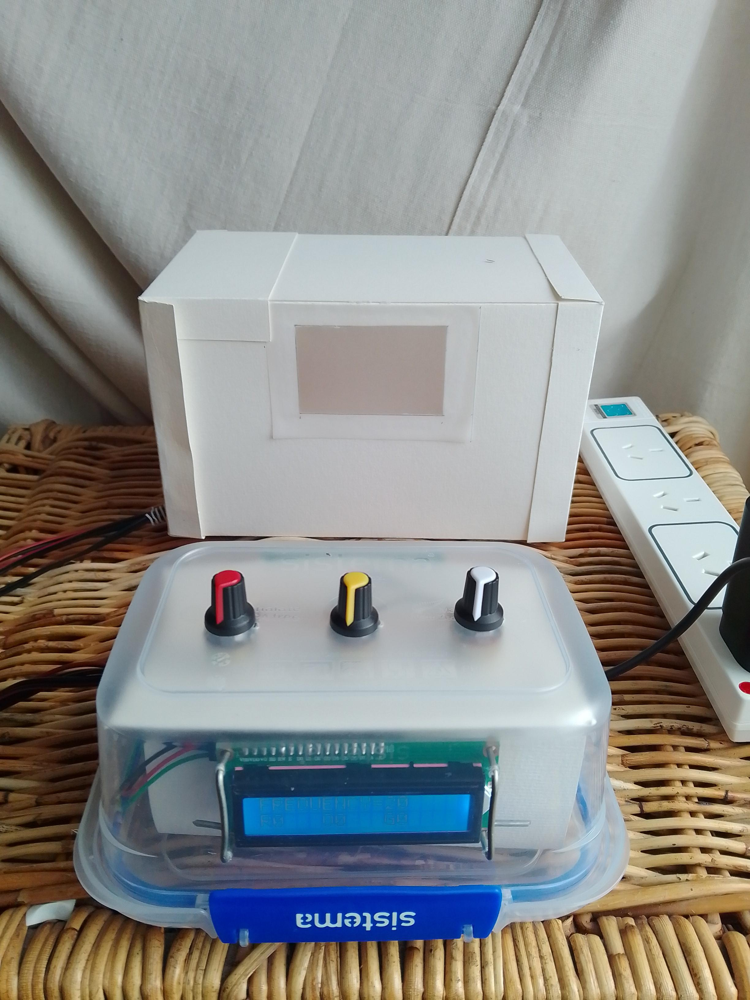
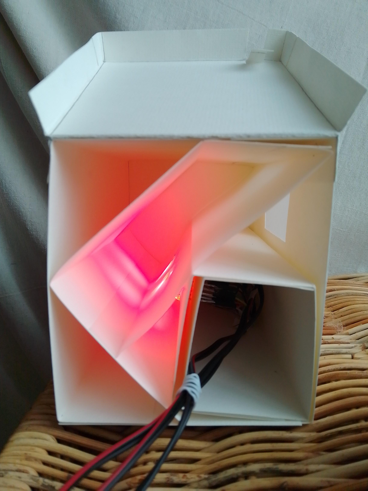

# Tetrachromacy tester

This project implements a DIY device for screening orange-cone tetrachromacy using Heterochromatic Flicker Photometry (HFP).

Tetrachromacy is a hypothesised ability of some women to be able to discern the 4th dimension of color via additional mutated visual receptors. Most humans have just three types of color receptors: red, green and blue. Tetrachromats would possess four.

I've built this device to test my young daughter for tetrachromatic perception.

## Theory

The test rapidly alternates two light sources — one pure orange LED and one mixed red+green source — at ~20 Hz. The subject adjusts the red and green intensities using potentiometers to try and eliminate visible flicker. A successful flicker cancellation suggests typical trichromatic vision, while persistent flicker may indicate tetrachromatic perception.

## Example test

The following video captures how a test might be conducted. First, each bank of LEDs is controlled separately. Then green bank of LEDs is set to maximum (as it's the weakest and has least resolution, so it's best left fixed), and then red and orange is tweaked to attempt to remove the flicker completely. This cannot be shown on video due to the interplay with camera and recording framerate.

[Click here to go to the YouTube video](https://www.youtube.com/watch?v=fo7DTIZ4m54)

Unfortunately the test cannot be replicated on screen, as pure orange light is needed. Neither the camera, the recording, nor a typical computer screen is able to reproduce pure orange, because these systems are inherently trichromatic - they create an illusion of orange by mixing red and green.

It's extremely rare for men to be tetrachromats, so unsurprisingly I am able to eliminate the flicker almost completely by using my eyes. I can't tell apart orange from a mix of green and red. I said "almost" because the flicker effect varies depending on the viewing conditions and position of the eyes. For example peripheral vision has a lower [critical flicker frequency](https://en.wikipedia.org/wiki/Flicker_fusion_threshold]) so at 20Hz I'm still able to see the flicker if I look away from the viewport.

Theoretically, if I was a tetrachromat I wouldn't be able to prevent the flicker because in my brain red and green would not mix to create orange, as it does in regular humans.

Even if I possessed the fourth receptor, for a fully functional tetrachromacy neural pathways must exist in the brain to process the extra dimension of signal. These pathways may be missing due to genetics, or perhaps these pathways might have atrophied due to societal conditioning during childhood (e.g. dad insisting that orange is the same as hyper-orange). 

Ability to eliminate flicker in this test does not definitely disprove tetrachromacy. I've used commercially available LEDs, and while I tried to get the best frequencies for this setup (e.g. with relatively narrow FWHM of 20nm), the LEDs are probably still bleeding colors into each other's spectrum. This could be creating a metameric match even for a tetrachromat (metameric match is where two colors appear the same under certain viewing conditions).

## Build

The device is built using an Arduino Uno, three LEDs, three potentiometers, and simple materials like cardboard. Red and orange PWM channels are configured for high-resolution brightness control, while green PWM channel in low-res mode due to Arduino Uno limitations.

Three buttons are also used for control of the software functions, such as HFP frequency. A "run test" mode is used for the actual test, which just disables the LCD screen redraw (which interferes with the test by introducing an annoying blink every second or so).

Diffusion box dimensions:

Here is the finished project:

Cardboard diffusion box makes sure lights are thoroughly mixed by facing the LEDs away from the viewer and by using three layers of tracing paper.

## Shopping list

Apologies, this list is a bit messy.

| Quantity | Part Number    | Manufacturer Part Number | Description                                               | Customer Reference              |
| -------- | -------------- | ------------------------ | --------------------------------------------------------- | ------------------------------- |
| 4        | TLCPG5100-ND   | TLCPG5100                | Digikey - LED GREEN CLEAR T-1 3/4 T/H                     | 562 [563nm] 1250mcd 50mA 2.1V   |
| 4        | 754-1611-ND    | WP710A10SYCK             | Digikey - LED YELLOW CLEAR T-1 T/H                        | 590nm 1500mcd 20mA 2V           |
| 2        | 754-1894-ND    | WP710A10SRC/J4           | Digikey - Red 640nm LED Indication - Discrete 2.1V Radial | 640nm [660nm] 1500mcd 20mA 2.1V |
| 1        | 1528-1743-ND   | 1311                     | Digikey - HOOK-UP 22AWG SOLID - 6 X 25FT                  | good for 300 mA (0.3 A) @ 5V    |
| 3        | SBBTH1506-1-ND | SBBTH1506-1              | Digikey - BREADBOARD GENERAL PURPOSE PTH                  | small 15x8                      |
| 1        | 1528-4786-ND   | 4786                     | Digikey - BREADBOARD GENERAL PURPOSE PTH                  | large 18x22 (maybe 3?)          |
| 1        | SAM1112-32-ND  | TS-132-T-A               | Digikey - CONN HEADER VERT 32POS 2.54MM                   |                                 |
| 2        | 1568-1513-ND   | PRT-12796                | Digikey - JUMPER WIRE F/F 6" 20PCS                        | good for 50 mA @ 5V             |
| 2        | 1528-4448-ND   | 4448                     | CBL ASSY USB M-CB W/JUMPER 0.98'                          |                                 |
|          |                |                          | Leftover LCD screen 16x2                                  |                                 |
|          |                |                          | Leftover Geekcreeit "Arduino Uno"                         |                                 |
|          |                |                          | Leftover prototype shield                                 |                                 |
|          |                |                          | HD44780 LCD screen I2C backpack                           |                                 |
|          |                |                          | A box of pots from Aliexpress (B5K/10K etc)               |                                 |
|          |                |                          | Leftover buttons                                          |                                 |
|          |                |                          | Leftover resistors                                        |                                 |
|          |                |                          | A box of transistors from Aliexpress (2N2222 etc)         |                                 |
|          |                |                          | Leftover audio cable                                      |                                 |
|          |                |                          | Cardboard, tracing paper, hot glue, paper glue            |                                 |
|          |                |                          | A lunchbox                                                |                                 |
|          |                |                          | Leftover 3A USB power supply 5V                           |                                 |